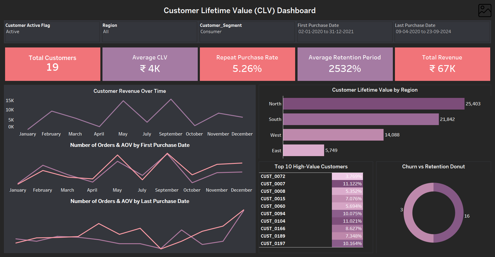

# 💼 Customer Lifetime Value Dashboard

## 📌 Project Overview
A fully interactive Tableau dashboard designed to measure **Customer Lifetime Value**, analyze **retention vs churn**, and identify **high-value customer groups** using advanced analytics such as LODs, cohorts, and interactive actions.

---

## ⭐ STAR Method Breakdown

### **S — Situation**
Businesses struggle to understand **which customers generate long-term value**, how retention changes over time, and which segments contribute the most revenue.

### **T — Task**
Build a **comprehensive CLV analytics dashboard** that visualizes customer profitability, retention behavior, and churn trends using Tableau.

### **A — Action**
- Designed a multi-page Tableau dashboard using **LOD Expressions**, **Cohort Analysis**, **Parameters**, **Table Calculations**, and **Dashboard Actions**.  
- Engineered key KPIs: **CLV**, **Retention Rate**, **Repeat Purchase Rate**, **AOV**, **Customer Tenure**, and **Churn %**.  
- Built interactive views: CLV trends, cohort retention, segment performance, churn donut, regional comparison, and Top 10 high-value customers.  
- Created a clean navigational layout with filters for Region, Segment, Status, and Date Range.

### **R — Result**
Delivered a dashboard enabling teams to:  
- Identify **Top 20% customers contributing majority CLV**  
- View **Active vs Churned** behavior instantly  
- Track **Month-over-Month CLV growth**  
- Improve segmentation and CRM targeting decisions  

---

## 📊 Tools & Technologies
- Tableau Desktop
- CSV Dataset
- LOD Expressions, Table Calcs, Cohorts

---

## Live Dashboard
🔗 ([Live Dashboard](https://public.tableau.com/app/profile/shadan.sarfaraz/viz/Customer_Lifetime_Value_Dashboard/CustomerLifetimeValueCLVDashboard?publish=yes))

---

## 📊 Dashboard

---

## 🎯 Objectives
- Measure **Customer Lifetime Value (CLV)** across segments and regions  
- Track **Retention, Churn, and Repeat Purchase** behavior  
- Identify **High-Value Customers**  
- Analyze **Tenure & Cohort Trends**  
- Provide a visually clear marketing & CRM decision tool  

---

## 📊 Key Insights Delivered
- Regions & segments with highest CLV  
- Month-over-month CLV growth trends  
- % Active vs Churned customers  
- Cohort retention behavior  
- Top 10 customers by lifetime value  

---

# ⚙️ Tableau Features Used
- **LOD Expressions**  
- **Cohort Analysis**  
- **Parameters (Metric Switcher)**  
- **Table Calculations**  
- **Dashboard Actions (Click-to-Filter)**  
- **Story Points**  

---

## 👤 Author
**Shadan Tech**   
_Data Analyst_

🔗 [LinkedIn Profile](http://www.linkedin.com/in/shadantech)
🔗 [Tableau Public Profile](https://public.tableau.com/app/profile/shadan.sarfaraz/vizzes)
🔗 [Newsletter](https://shadantech.substack.com/)

---

## ⭐ Show Your Support
If you found this project insightful, give it a **⭐ Star** on GitHub — it helps others discover it too!  
Connect on **LinkedIn** for more Power BI, Tableau, and Data Analytics projects.